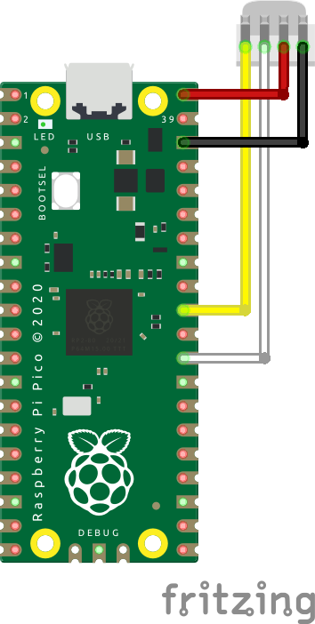

# Hardware 

## motors
**[28BYJ-48](motorsmd#28byj-48)** <br>
**[DC-motor](motorsmd#dc-motor-small)** <br>

## combined
**[M5stack Watering Unit](combinedmd#watering-unit)** <br>

### Watering Unit 

From M5Stack there is the [Watering Unit](https://docs.m5stack.com/en/unit/watering). A combination of a water-pump and a capacitive soil-moisture sensor.



Be carefull when connecting the cables to the pico-pi (I used an adaptor, yellow and white are switched, so colours do not match!). 

Getting the data from the capacitive sensor is done with reading the ADC. The pump is controlled by one of the GP pins (number 22 in the example). Setting the pin to high allows the motor to run. 

```python
from machine import Pin, ADC
import time

sensor = ADC(Pin(26))
pump = Pin(22, Pin.OUT)
LED = Pin(25, Pin.OUT)

conversion = 3.3 / (2**16-1)
LED.value(1)

while True:
    print(sensor.read_u16()*conversion)
    if sensor.read_u16()*conversion > 1.7:
        pump.value(1)
        time.sleep(5)  # plants are thirsty
        pump.value(0)
    time.sleep(15)  # make sure all water is distributed
```
With the green LED on while the systems is running. By changing the value of 1.7 in th etest the pump can run at different levels of moisture. 
