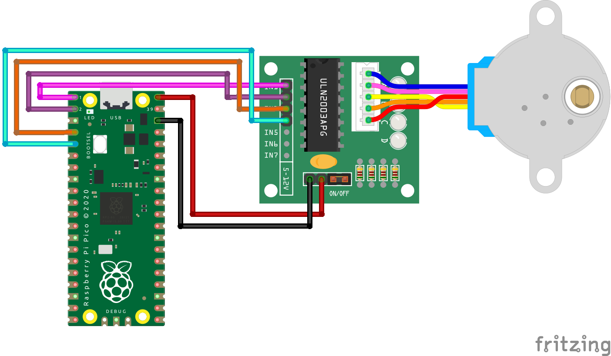
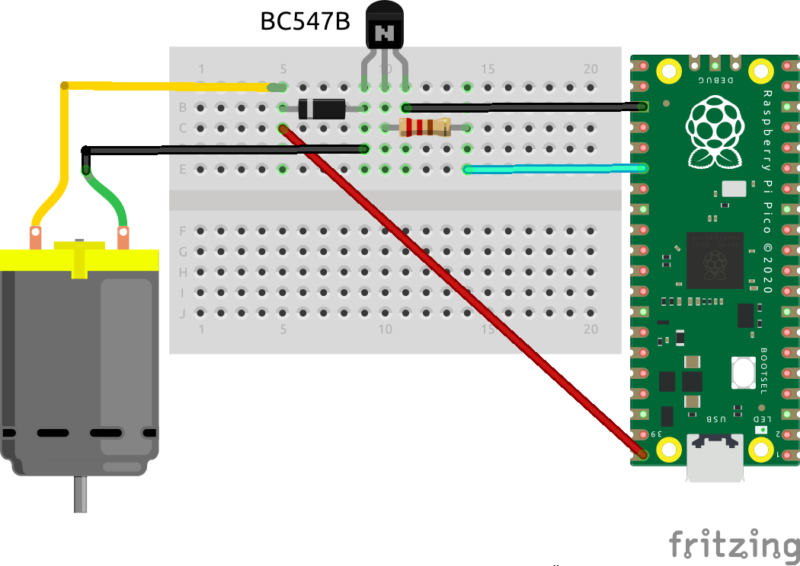

# Hardware 

## motors
**[28BYJ-48](hardware#28byj-48)** <br>
**[DC-motor](#dc-motor-small)** <br>


### 28BYJ-48
The [28BYJ-48](28byj48-step-motor-datasheet.pdf) is a cheap steppermotor. Together with the ULN2003 driverboard it is easy to setup.
For the wiring 4 GPIO pins from te RaspberryPi Pico are necessary. For testing purpose it is possible to use the VSYS from the RaspberryPi Pico. If using the motor (or multiple motors) at full power the powersupply should be an external one. 


The run the motor for 100 steps (there are about 2038 full steps in a revolution) with half steps: 
```python
import motor_step_28BYJ as motor
step = motor.Stepper28BYJ([0, 1, 2, 3], steps='half')
step.run(100)
```
or change the steps to full and the direction to counter-clockwise without creating a new motor object:
```python
step.set_steps(steps='full', direction='ccw')
step.run(2038//2)
```
Make sure both the [motor_step_28BYJ.py](motor_step_28BYJ.py) and [tools.py](tools.py) file are in the root of the RaspberryPi Pico.

### DC-motor (small)
A small DC motor (upto 200mA), like the [Adafruit DC Toy motor](https://www.adafruit.com/product/711) can be controlled by the RaspberryPi Pico with just a diode, resistor and a transistor. 

#### Parts
 - transistor (BC547B)
 - diode (IN4007)
 - resistor (220 Ohm)
 - motor
 - RaspberryPi Pico

The base of the transistor is wired to the RaspberryPi Pico (PIN 20) trough the resistor. The emittor is wired to the ground of the RaspberryPi Pico and the collector is wired trough the diode to one terminal of the motor AND the VBUS port of the RaspberryPi Pico (connected trough USB this allows for 5V, upto 300 mA). The other terminal of the motor is connected directly to the collector pin of the transistor. 


The motor can be controlled in an [on-off](motor_DC_onoff.py) version:
```python
import machine
import time

motor = machine.Pin(20, machine.Pin.OUT)

motor.high()
time.sleep(2)
motor.low()
```

Or with [Pulse-Width Modulated](motor_DC_PWM.py) pins (PWM):
```python
import machine
import time

motor = machine.PWM(machine.Pin(20))

motor.freq(1000)

for duty in range(65025):
    motor.duty_u16(duty)
    time.sleep(0.0001)
time.sleep(2)
for duty in range(65025,0,-1):
    motor.duty_u16(duty)
    time.sleep(0.0001)
```
where the frequency together with the duty-cycle set the speed of the motor.
